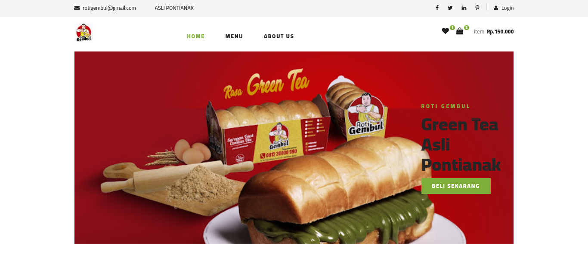
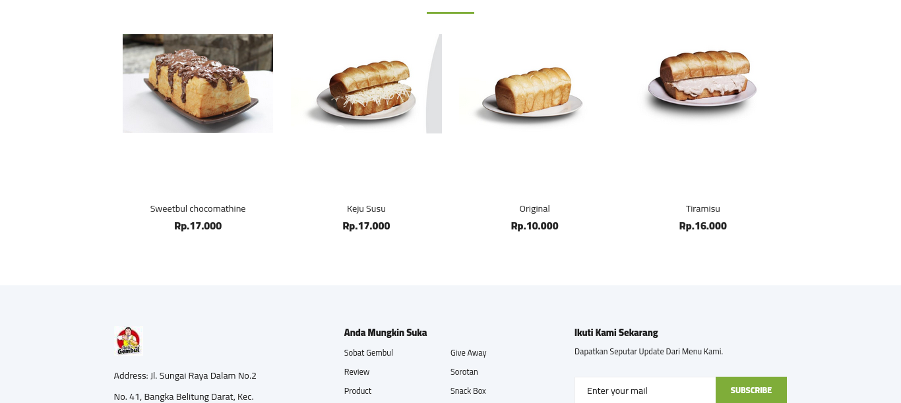
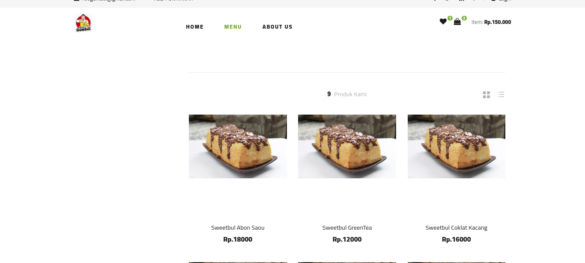
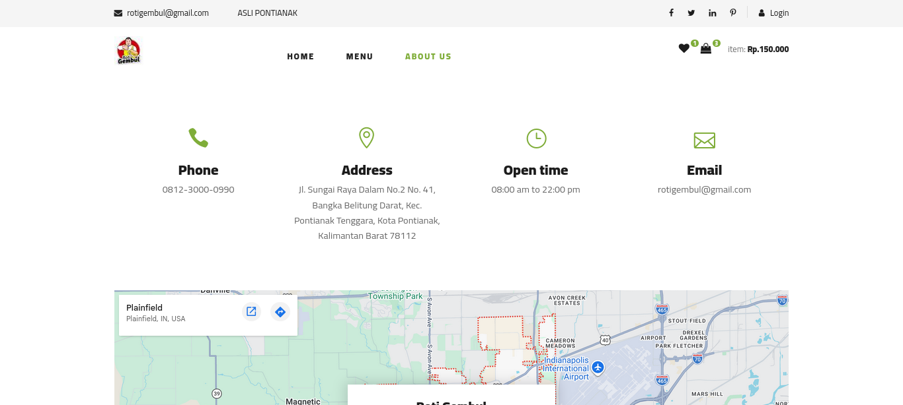
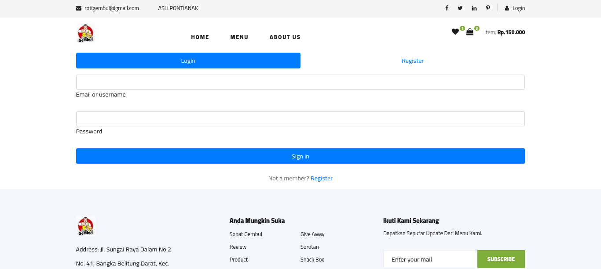

<div align="center">
  <br />
    
  <br />

# Roti Gembul

**A Modern Web Application for Roti Gembul**

  <p align="center">
    <!-- Ganti URL badge ini dengan yang sesuai nantinya -->
    
    
    
  </p>
</div>

---

## 📸 Tampilan Website (Screenshots)

> _Silakan tambahkan foto-foto screenshot website di bawah ini._

### Halaman Utama (Landing Page)









### Halaman Login



---

## 🛠️ Teknologi yang Digunakan

- **Framework**: Laravel
- **Database**: MySQL
- **Frontend**: Blade Templates / Tailwind CSS / Bootstrap _(sesuaikan)_
- **Lainnya**: _(tambahkan jika ada)_

## 🚀 Panduan Instalasi (Local Development)

Ikuti langkah-langkah di bawah ini untuk menjalankan project di komputer lokal Anda:

1. **Clone repository ini**

    ```bash
    git clone https://github.com/username/rotigembul.git
    cd rotigembul
    ```

2. **Install dependencies (PHP & Node.js)**

    ```bash
    composer install
    npm install && npm run build
    ```

3. **Konfigurasi Environment**
    - Copy file `.env.example` menjadi `.env`

    ```bash
    cp .env.example .env
    ```

    - Generate application key:

    ```bash
    php artisan key:generate
    ```

4. **Konfigurasi Database**
   Buka file `.env` dan atur koneksi database Anda:

    ```env
    DB_CONNECTION=mysql
    DB_HOST=127.0.0.1
    DB_PORT=3306
    DB_DATABASE=rotigembul
    DB_USERNAME=root
    DB_PASSWORD=
    ```

5. **Jalankan Migrasi & Seeder**

    ```bash
    php artisan migrate --seed
    ```

6. **Jalankan Aplikasi**
    ```bash
    php artisan serve
    ```
    Aplikasi dapat diakses melalui browser di: `http://localhost:8000`

## 📝 Lisensi

Project ini dilisensikan di bawah [MIT License](LICENSE).
